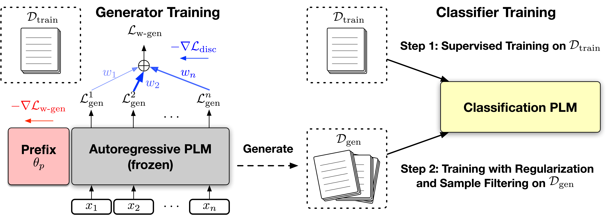

# FewGen

The source code for [Tuning Language Models as Training Data Generators for Augmentation-Enhanced Few-Shot Learning](https://arxiv.org/abs/2211.03044), published in ICML 2023.

## Requirements

Before running, you need to first install the required packages by typing following commands (Using a virtual environment is recommended):

```
pip3 install -r requirements.txt
```

## Overview

**FewGen** is a **Few**-shot data **Gen**eration method for NLU tasks. **FewGen** first tunes a generative language model on the few-shot samples and then synthesizes novel training data as augmentations.

</img>

## Data Preparation

You need to download the few-shot data splits defined in [LM-BFF](https://github.com/princeton-nlp/LM-BFF) by running the following commands:

```
cd data
bash download_data.sh
cd ..
python utils/gen_k_shot.py
```
**Pretraining Corpus for Sequence-Pair Tasks**: We provide the processed pretraining corpus (Wikipedia and OpenWebText) for generating training data for sequence-pair tasks under the [`pretrain_corpus`](pretrain_corpus) directory; see the [README file](pretrain_corpus/README.md) there for details.

## Tuning the Generator

The generated training data used in the paper are provided as `gen-train.json` files under the dataset directory corresponding to each task and seed (e.g., `data/k-shot/CoLA/16-13/gen-train.json`). If you do not want to train the generator to generate the synthetic data on your own, you could skip this section and the next, and directly jump to the [**Training the Classifier**](#training-the-classifier) Section. Otherwise, follow the steps below to train the generator on the few-shot samples and generate synthetic data (next section) yourself.

**Training Script**: The generator will be trained with prefix-tuning on the few-shot samples. The training will be conducted by running `bash train_gen.sh $GPU $TASK $SEED`, where `$GPU` is the CUDA device ID (e.g., `0`), `$TASK` is the task (e.g., `MNLI`), `$SEED` is the seed (from `[13, 21, 42, 87, 100]`).

**GPU Memory Requirement**: The default setting (i.e., unmodified code) requires ~30GB of a single GPU for tuning the generator. If your GPU does not meet the memory requirement, you could (1) disable meta-weight learning by excluding the `--meta_weight` command line argument in the `train_gen.sh` file [here](train_gen.sh#L52) (which will reduce the GPU memory requirement and will result in slightly worsened but still decent generators), or (2) use a smaller generator model.

## Generating Training Data

After the generator is tuned on the few-shot samples, we can use it to generate novel training samples. 

**Data Generation Script**: Run `bash gen_train_data.sh $GPU $TASK $SEED $LABEL $NUM_GEN`, where `$GPU` is the CUDA device ID (e.g., `0`), `$TASK` is the task (e.g., `MNLI`), `$SEED` is the seed (from `[13, 21, 42, 87, 100]`),`$LABEL` is the label conditioned on which the data are generated (e.g., `entailment`), and `$NUM_GEN` is the number of samples to be generated (e.g., `5000`). The generated data will be saved under `gen_res_${TASK}_${SEED}` as json files.

**Combining Generated Data to Construct the Training Set**: After generating the training data for each label separately, we need to combine them to form the training set by running `python utils/gen_utils.py --task $TASK --seed $SEED` where `$TASK` is the task (e.g., `MNLI`) and `$SEED` is the seed (from `[13, 21, 42, 87, 100]`). The training set will be saved under `data/k-shot/$TASK/16-$SEED` as `gen-train.json` files.

## Training the Classifier

The classifier training consists of two steps: First train on the few-shot samples and then continue training on the synthetic data.

**Classifier Fine-Tuning on Few-Shot Samples**: We first train the classification model on the original few-shot training set. This can be done by running `bash run_finetune_on_fewshot.sh $GPU $TASK $SEED $LR $BS`, where `$GPU` is the CUDA device ID (e.g., `0`), `$TASK` is the task (e.g., `MNLI`), `$SEED` is the seed (from `[13, 21, 42, 87, 100]`), `$LR` is the learning rate (e.g., `1e-5`) and `BS` is the batch size (e.g., `4`). The training logs, results and tuned checkpoints will be saved under `fewshot_result/$TASK/$SEED/`.

**Selecting the Best Model for Continued Training on Synthetic Data**: Next, we need to select the best-performing model out of all hyperparameter combinations based on the dev set results. This can be done by running `python utils/get_best_fewshot_model.py --dir fewshot_result/$TASK/$SEED/`, where `$TASK` is the task (e.g., `MNLI`) and `$SEED` is the seed (from `[13, 21, 42, 87, 100]`). The selected model checkpoint will be copied to `fewshot_result/$TASK/$SEED/best`.

**Classifier Fine-Tuning on Generated Samples**: Finally, we continue training the selected model checkpoint on our generated training sets by running `bash run_finetune_on_gen.sh $GPU $TASK $SEED`, where `$GPU` is the CUDA device ID (e.g., `0`), `$TASK` is the task (e.g., `MNLI`) and `$SEED` is the seed (from `[13, 21, 42, 87, 100]`). The training logs, results and tuned checkpoints will be saved under `final_result/$TASK/$SEED/`. The test set results report can be generated by running `python utils/get_final_result.py`.


## Acknowledgement

Some scripts in this repository are adapted from [SuperGen](https://github.com/yumeng5/SuperGen) (for training data generation), [LM-BFF](https://github.com/princeton-nlp/LM-BFF) (for prompt-based fine-tuning) and [huggingface transformers](https://github.com/huggingface/transformers) (for GLUE processor and trainer).

## Citations

Please cite the following paper if you find the code helpful for your research.
```
@inproceedings{Meng2023TuningLM,
  title={Tuning Language Models as Training Data Generators for Augmentation-Enhanced Few-Shot Learning},
  author={Yu Meng and Martin Michalski and Jiaxin Huang and Yu Zhang and Tarek Abdelzaher and Jiawei Han},
  booktitle={International Conference on Machine Learning},
  year={2023}
}
```
